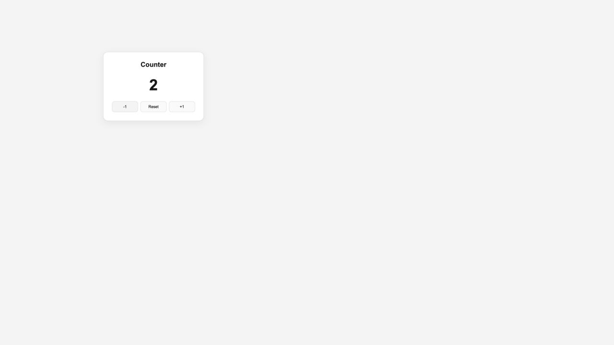

# Day 40 — Zustand 카운터

## 실행

```bash
npm install
npm run dev
```

`src/stores/counterStore.ts`에서 상태와 변경 함수를 정의하고,
`src/app/page.tsx`에서 각각의 selector로 가져와 기존 UI에 연결했습니다.

## 완료 조건

- +1 버튼: count가 1 증가
- -1 버튼: count가 1 감소
- Reset 버튼: count가 0으로 변경
- React useState를 사용하지 않음

## 검증 결과

- `npm run build` 및 TypeScript 검사 통과
- 초기값 0, 증가·감소·Reset 및 음수 동작 확인
- `+1 → +1 → +1 → -1` 후 2가 표시됨
- 브라우저 콘솔 오류 없음


